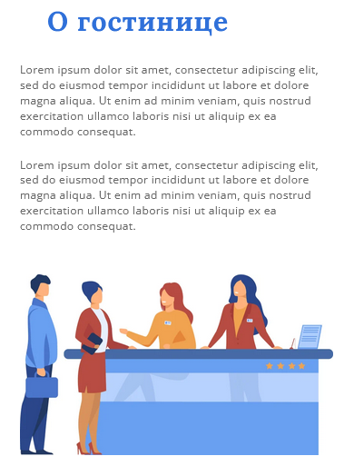
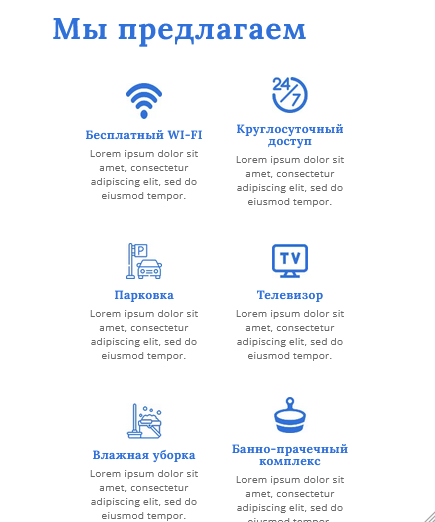
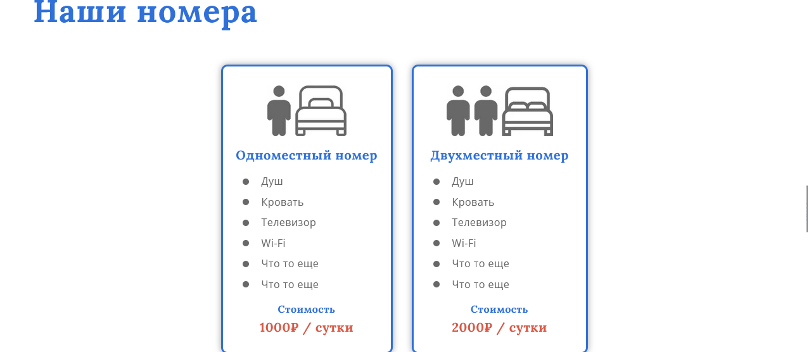
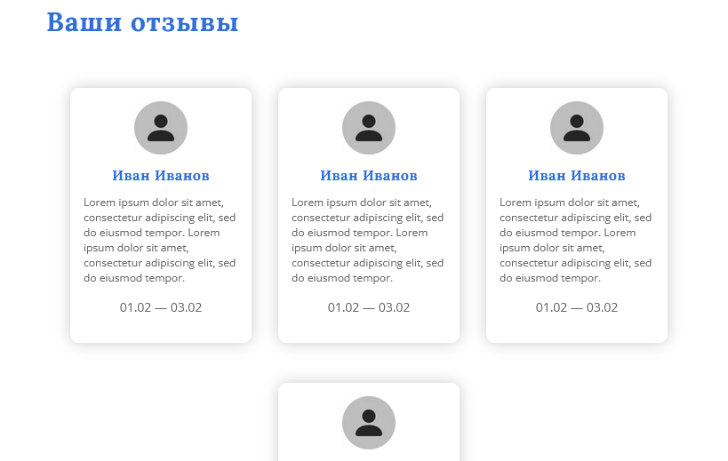

# Baikal Hotel
Адаптивный лендинг гостиницы 'Байкал'(mobile-first-подход) - верстка по макету из figma.
Это пет проект, созданный для демонстрации навыков точной реализации дизайна и современной фронтэнд-разработки. 
## О проекте
**Верстка выполнена по готовому макету Figma** с соблюдением всех отступов, цветов и типографики.  
Сделано с акцентом на mobile-first подход.
##Прилагаю скриншоты: 
1. Главный экран 
2. О гостинице 
3. Мы предлагаем 
4. Наши номера 
5. Ваши отзывы 

## Использованные технологии:
HTML, SCSS, JavaScript.
- Семантическая вёрстка **HTML5**;
- Препроцессор **SCSS** (7-папочная структура, переменные, миксины);
- **Mobile-first** + адаптив (Flexbox + Grid + media queries);
- Чистый **JavaScript (ES6+)**;
- Точная реализация дизайна из Figma;

  ## Основные возможности проекта
- Главный раздел с крупным заголовком и кнопкой «Забронировать»;
- Блок «О гостинице» с описанием;
- Раздел «Мы предлагаем» — 9 услуг с иконками;
- Блок «Наши номера» — два типа номеров с характеристиками;
- Секция «Ваши отзывы»;
- Блок «Контакты» с адресом, телефонами и информацией для бронирования;
- Адаптивность от 320px до больших экранов;
